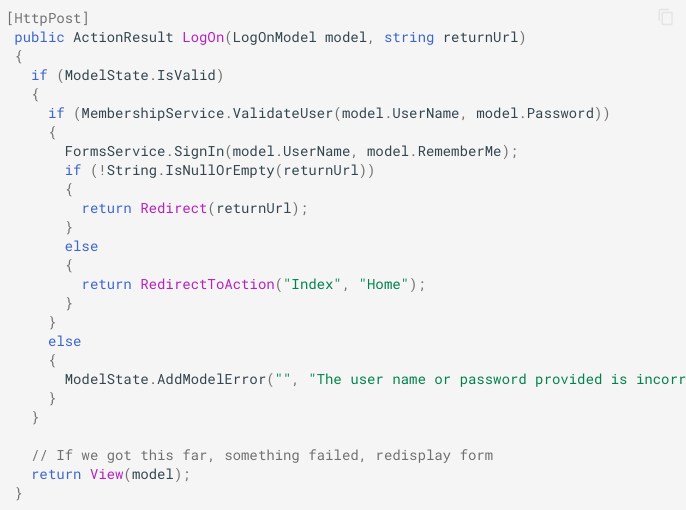

# Open URL Redirect

## Summary
When a web application accepts untrusted input, it can cause the app to redirect the user to a specific URL contained in that input that is not within the application. 

* Attackers can leverage this to modify the input and redirect users to a malicious site. 
* If a user lands on a suspicious website, they will be exposed to the risk of malware conducting keylogging, a phishing scam or other attacks that could steal their credentials and personally identifiable information (PII). 

## Solution

- [x] Avoid using redirects and forwards, or if necessary, don’t allow user input for the destination
- [x] If user input needs to be used, the supplied value needs to be validated before redirecting the user
- [x] Parameters that are used for redirecting should be restricted only to paths within the application

## Further Reading
* https://cwe.mitre.org/data/definitions/601.html
* https://portswigger.net/kb/issues/00500100_open-redirection-reflected 
* https://blog.intigriti.com/hackademy/open-redirect/ 

